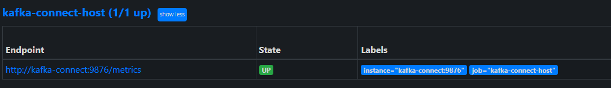
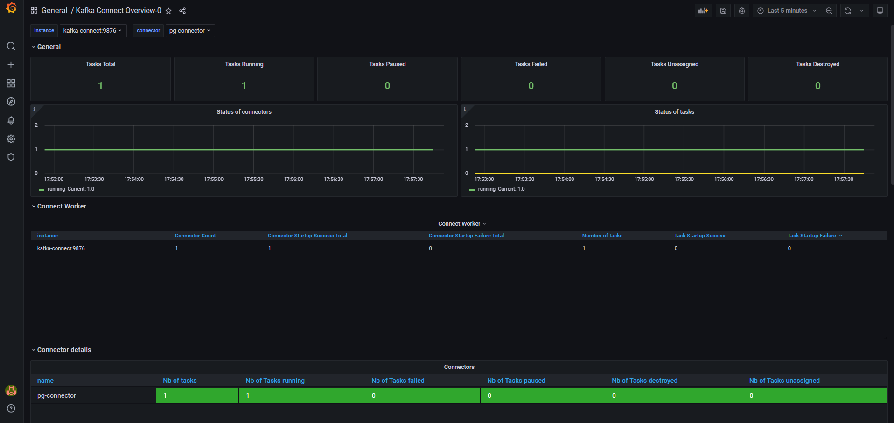

## Архитектура проекта

Проект работает по следующему принципу:

* Пользователь добавляет в Postgres записи в таблицы Users и Orders
* Kafka Connect, используя коннектор Debezium, считывает эти записи, и отправляет в топики `customers.public.users`и `customers.public.orders`
* Реализованный на Python Consumer считывает записи из Kafka (из обоих топиков) и выводит в консоль
* Kafka Connect, используя метрики JMX, отдаёт метрики коннектора
* Prometeus периодически считывает метрики Kafka Connect и записывает в свою базу данных
* Grafana подключается к Prometeus и отображает метрики в дашбордах

## Настройки Debezium Connector

Настройки хранятся в файле connector.json и применяются через REST API Kafka Connect. Они следующие:

```json
{
 "name": "pg-connector",
 "config": {
   "connector.class": "io.debezium.connector.postgresql.PostgresConnector", // класс коннектора
   "database.hostname": "postgres", // хост БД
   "database.port": "5432", // порт БД
   "database.user": "postgres-user", // пользователь БД
   "database.password": "postgres-pw", // пароль БД
   "database.dbname": "customers", // имя БД
   "database.server.name": "customers", // имя БД в Kafka Connect
   "table.include.list": "public.users,public.orders", // отслеживаемые таблицы
   "transforms": "unwrap", // применяемые трансформации
   "transforms.unwrap.type": "io.debezium.transforms.ExtractNewRecordState", // извлекать только изменённые данные
   "transforms.unwrap.drop.tombstones": "false", // отправлять tombstones в Kafka (операции DELETE)
   "transforms.unwrap.delete.handling.mode": "rewrite", // отправлять значения полей при удалении записей
   "topic.prefix": "customers", // префикс создаваемых в Kafka топиков
   "topic.creation.enable": "true", // включить создание топиков 
   "topic.creation.default.replication.factor": "-1", // replication factor топиков 
   "topic.creation.default.partitions": "-1", // количество партиций топиков
   "skipped.operations": "none" // включить все действия с БД
 }
}
```

## Запуск проекта

* Запустить kafka-connect и обвязку: `docker compose up -d kafka-connect`
* Проверить, что успешно подключился плагин в kafka connect: в ответе `curl localhost:8083/connector-plugins` должно содержаться `io.debezium.connector.postgresql.PostgresConnector`
* Создать таблицы:
```bash
docker compose exec postgres psql -U postgres-user -d customers
```
```sql
CREATE TABLE users (
    id SERIAL PRIMARY KEY,
    name VARCHAR(100),
    email VARCHAR(100),
    created_at TIMESTAMP DEFAULT CURRENT_TIMESTAMP
);


CREATE TABLE orders (
    id SERIAL PRIMARY KEY,
    user_id INT REFERENCES users(id),
    product_name VARCHAR(100),
    quantity INT,
    order_date TIMESTAMP DEFAULT CURRENT_TIMESTAMP
); 
```
* Создать конфигурацию коннектора:
```bash
curl -X POST -H 'Content-Type: application/json' --data @connector.json http://localhost:8083/connectors
```
* Запустить консьюмер: `docker compose up -d consumer`
* Запустить Prometheus и Grafana: `docker compose up -d grafana`

## Тестирование проекта

* Добавить несколько записей в таблицы users и orders:
```bash
docker compose exec postgres psql -U postgres-user -d customers
```
```sql
-- Добавление пользователей
INSERT INTO users (name, email) VALUES ('John Doe', 'john@example.com');
INSERT INTO users (name, email) VALUES ('Jane Smith', 'jane@example.com');
INSERT INTO users (name, email) VALUES ('Alice Johnson', 'alice@example.com');
INSERT INTO users (name, email) VALUES ('Bob Brown', 'bob@example.com');

-- Добавление заказов
INSERT INTO orders (user_id, product_name, quantity) VALUES (1, 'Product A', 2);
INSERT INTO orders (user_id, product_name, quantity) VALUES (1, 'Product B', 1);
INSERT INTO orders (user_id, product_name, quantity) VALUES (2, 'Product C', 5);
INSERT INTO orders (user_id, product_name, quantity) VALUES (3, 'Product D', 3);
INSERT INTO orders (user_id, product_name, quantity) VALUES (4, 'Product E', 4); 
```
* Посмотреть вывод consumer (`docker compose logs -f consumer`), он должен успешно выводить вставленные строки из базы данных, например:
```json
{"topic": "customers.public.users", "partition": 0, "offset": 5, "key": {"id": 6}, "message": {"id": 6, "name": "Jane Smith", "email": "jane@example.com", "created_at": 1748096784907638, "__deleted": "false"}, "timestamp": 1748096785413}

{"topic": "customers.public.orders", "partition": 0, "offset": 6, "key": {"id": 7}, "message": {"id": 7, "user_id": 1, "product_name": "Product B", "quantity": 1, "order_date": 1748096784913367, "__deleted": "false"}, "timestamp": 1748096785415}

{"topic": "customers.public.users", "partition": 0, "offset": 6, "key": {"id": 7}, "message": {"id": 7, "name": "Alice Johnson", "email": "alice@example.com", "created_at": 1748096784908759, "__deleted": "false"}, "timestamp": 1748096785413}

{"topic": "customers.public.orders", "partition": 0, "offset": 7, "key": {"id": 8}, "message": {"id": 8, "user_id": 2, "product_name": "Product C", "quantity": 5, "order_date": 1748096784914664, "__deleted": "false"}, "timestamp": 1748096785415}

{"topic": "customers.public.users", "partition": 0, "offset": 7, "key": {"id": 8}, "message": {"id": 8, "name": "Bob Brown", "email": "bob@example.com", "created_at": 1748096784909830, "__deleted": "false"}, "timestamp": 1748096785414}

c{"topic": "customers.public.orders", "partition": 0, "offset": 8, "key": {"id": 9}, "message": {"id": 9, "user_id": 3, "product_name": "Product D", "quantity": 3, "order_date": 1748096784915860, "__deleted": "false"}, "timestamp": 1748096785416}

{"topic": "customers.public.orders", "partition": 0, "offset": 9, "key": {"id": 10}, "message": {"id": 10, "user_id": 4, "product_name": "Product E", "quantity": 4, "order_date": 1748096784917048, "__deleted": "false"}, "timestamp": 1748096785416}
```
* Проверить, что Prometheus получает метрики Kafka Connector, для этого перейти по адресу http://localhost:9090/targets, там должен быть target `kafka-connect-host` со State UP:


* Зайти в Grafana: http://localhost:3000/d/kafka-connect-overview-0/kafka-connect-overview-0?from=now-5m&to=now&orgId=1. Должен отображаться дашборд с метриками:

